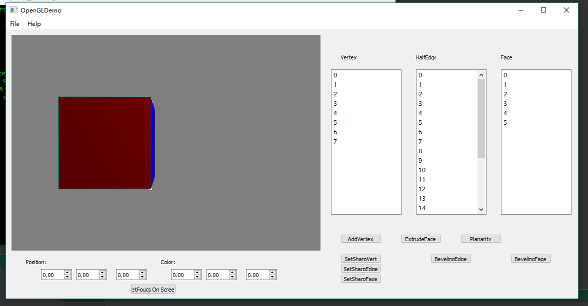
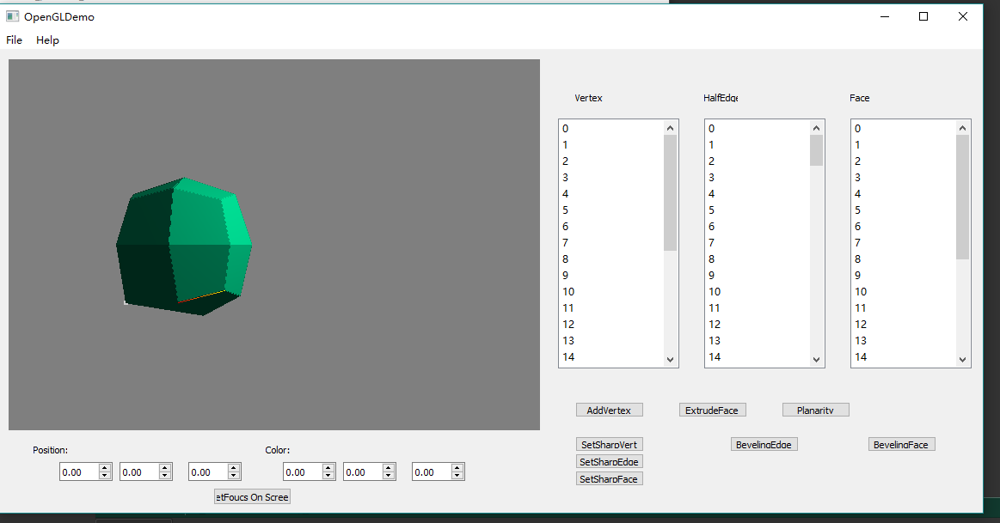
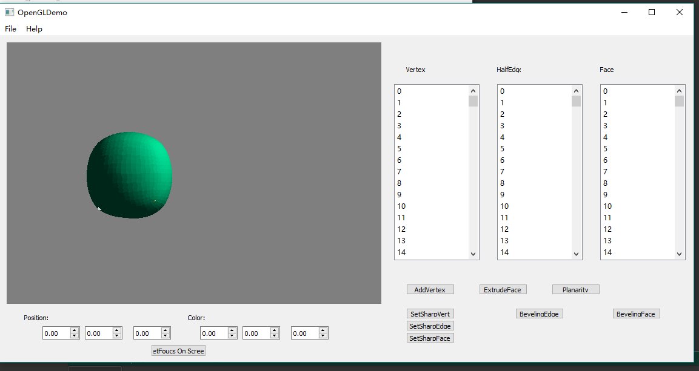
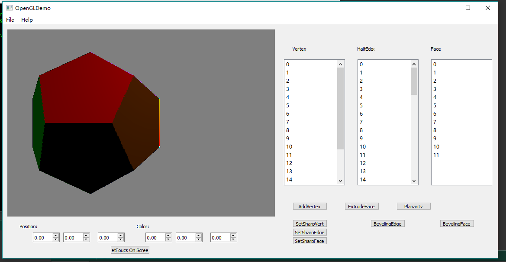
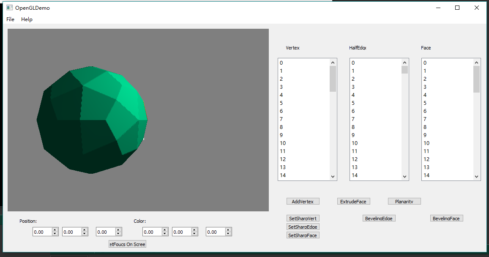
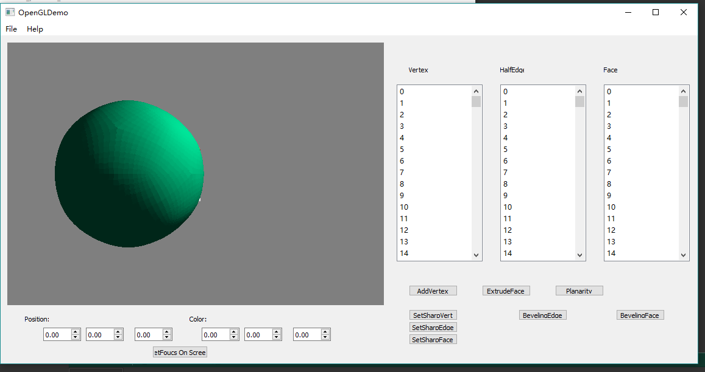
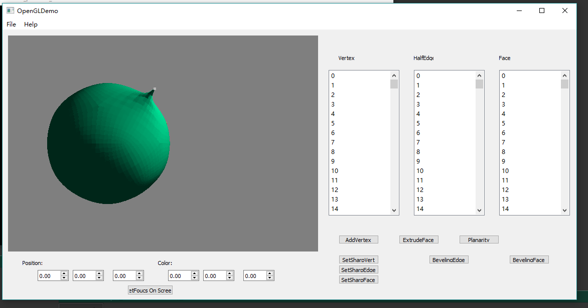
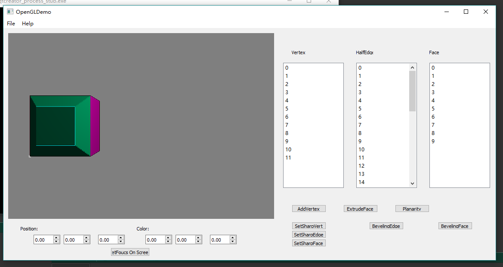

# ComputerGraphics_QT_HW06_Catmull-Clark Subdivision and Mesh Operations
implement the Catmull-Clark subdivision algorithm to smooth your meshes, along with a few other mesh structure alteration functions

# Description
* Add vertex to edge function
* Triangulate face function
* Catmull-Clark Subdivision
* Extrude face function
* Planarity test
* Sharp edges and vertices

# Screenshots & Results
* **Smooth(*Catmull-Clark Subdivision*) for Cube**
  * Before Smooth
    
    
  * Smooth Once
    

  * Smooth 4 Times
    
* **Smooth(*Catmull-Clark Subdivision*) for Dodecahedron**
  * Before Smooth
    
  * Smooth Once
    
  * Smooth 3 Times
    
* **Smooth(*Catmull-Clark Subdivision*) With Sharp Vertex**
    
* **Bevel Face**
    

